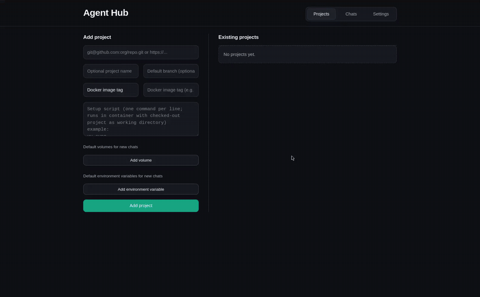

# Agent Hub

Local-first orchestration for containerized coding-agent workflows.

## Demo Video

<div align="center">
  <a href="docs/demo/agent_hub_demo_dark_trimmed_3s_cropped_webpage.mp4">
    
  </a>
</div>

## Why this

Codex and Claude web apps are strong hosted experiences. Agent Hub is for cases where hosted web UIs are the wrong boundary.

- Run on your own hardware and Docker daemon, including GPU hosts.
- Mount local repos, logs, datasets, caches, and credentials directly into runtime containers.
- Use deterministic setup snapshots (`setup script + image tag`) so new chats start from a known environment.
- Keep chat execution isolated (one workspace + process per chat).
- Publish files from inside the container with `hub_artifact`, then preview/download them in the hub UI with prompt-linked history.

If you need strict runtime control and local data locality, this is a better fit than browser-only Codex/Claude workflows.

## Hub Containers

Docker images are split by responsibility:

- `docker/agent_cli/Dockerfile`: chat runtime image used by `agent_cli`.
- `docker/agent_hub/Dockerfile`: production image for running `agent_hub` with a prebuilt frontend.
- `docker/development/Dockerfile`: full-project development container (tooling installed, no frontend prebuild).

Build/run instructions:

- `docker/agent_cli/README.md`
- `docker/agent_hub/README.md`
- `docker/development/README.md`

## Quickstart

### 1. `agent_cli` first (single session)

```bash
uv run agent_cli --project /path/to/repo
```

Important flags for a fast start:

- `--project`: host project directory to mount into the container.
- `--resume`: attempt `codex resume --last` before falling back to a fresh session.
- `--base`: Dockerfile path or directory to build a custom base image.
- `--setup-script` + `--snapshot-image-tag`: build/reuse a deterministic prepared image.
- `--ro-mount` / `--rw-mount`: add host mounts.
- `--env-var KEY=VALUE`: pass environment variables into the runtime.

Example:

```bash
uv run agent_cli \
  --project /path/to/repo \
  --rw-mount /var/log/my-run:/var/log/my-run \
  --env-var WANDB_MODE=offline \
  --resume
```

### 2. `agent_hub` next (multi-chat web control plane)

```bash
uv run agent_hub
```

Then open `http://127.0.0.1:8765`, add a project repo URL, wait for build status `Ready`, and create/start chats.

Important flags for quickstart:

- `--data-dir`: where hub state, chat workspaces, and secrets are stored.
- `--config-file`: config passed into every chat runtime.
- `--port` / `--host`: bind address for the hub API/UI.
- `--artifact-publish-base-url`: callback base URL reachable from chat containers.
- `--clean-start`: clear chat artifacts and cached setup images before serving.

No manual artifact wiring is required for `agent_hub` chats:

- `agent_hub` injects `AGENT_HUB_ARTIFACTS_URL` and `AGENT_HUB_ARTIFACT_TOKEN` into each chat runtime.
- `agent_hub` passes its config file into each runtime as `~/.codex/config.toml` for Codex.
- `agent_cli` derives shared prompt/context instructions from that same config and passes them to Claude via `--append-system-prompt`.
- The default `config/agent.config.toml` already includes developer instructions telling the agent to publish requested deliverable files with `hub_artifact publish <path> [<path> ...]`.
- Those config-driven developer instructions are applied automatically in hub-launched chats, so you do not need to manually paste extra prompt boilerplate.

## Chat Agent Prompt Context (Major Files)

For day-to-day prompt/setup changes, these are the main files that assemble most of the chat agent context:
These paths are resolved from each chat's checked-out target project workspace, not from the Agent Hub repository itself (unless Agent Hub is the target project).

1. `config/agent.config.toml`
   - Single source for shared chat prompt/context settings across Codex and Claude.
   - Passed into Codex chats as `~/.codex/config.toml`.
   - Used to derive Claude `--append-system-prompt` defaults (`developer_instructions` and project-doc bootstrap hints).
   - Main place for `developer_instructions` and project-doc auto-load settings.
2. `AGENTS.md` (in the checked-out project repo)
   - Primary repo-specific instruction file loaded by the agent.

If you run with a custom `--config-file`, that file replaces the default `config/agent.config.toml` source for chat setup/context.

## Requirements

- Linux or macOS with Docker CLI available.
- Docker daemon reachable from where you run `agent_cli` and `agent_hub`.
- Python 3.11+.
- `uv` (recommended).
- Node.js + Corepack (only when frontend build is needed).
- Optional NVIDIA GPU + `nvidia-container-toolkit` for GPU passthrough.

## Mobile (Capacitor)

If you want an Android/iOS wrapper around the existing Agent Hub web server, see:

- `docs/mobile_capacitor.md`

This includes Linux-first deploy scripts:

- `tools/mobile/deploy_phone.sh` (single wrapper command)
- `tools/mobile/deploy_android.sh`
- `tools/mobile/deploy_ios_via_ssh.sh` (Linux -> macOS via SSH)
- `tools/mobile/deploy_ios_on_macos.sh` (direct on macOS)

## `agent_cli` (detailed)

`agent_cli` is the runtime launcher. It builds images (if needed), mounts project/config/state paths, and starts the selected in-container agent process (`codex` by default, `claude` when requested).

Behavior highlights:

- Mounts your project into `/home/<user>/projects/<project-name>`.
- Mounts Docker socket (`/var/run/docker.sock`) so runtime tools can access Docker when available.
- Mounts config file to `~/.codex/config.toml` in the container (Codex runtime).
- Derives shared prompt/context instructions from the same config and appends them to Claude sessions (`--append-system-prompt`).
- Persists agent home state across runs with dedicated mounts for `~/.codex`, `~/.claude`, `~/.claude.json`, and `~/.config/claude`.
- Can build and reuse snapshot images for deterministic setup.
- Supports project-specific base image source from Docker tag, Dockerfile, or Docker context.
- Applies permissive in-container defaults unless you explicitly override them with trailing agent args:
  Codex uses `--ask-for-approval never --sandbox danger-full-access`; Claude uses `--permission-mode bypassPermissions`.
- In `agent_hub` repo-path mode, a Dockerfile file path uses repository-root build context, while a directory path uses that directory as context.

Key argument groups:

- Project and config:
  `--project`, `--config-file`, `--agent-home-path`, `--container-home`
- Base image selection:
  `--base`, `--base-docker-context`, `--base-dockerfile`, `--base-image`, `--base-image-tag`
- Deterministic setup:
  `--setup-script`, `--snapshot-image-tag`, `--prepare-snapshot-only`
- Runtime customization:
  `--ro-mount`, `--rw-mount`, `--env-var`
- Session behavior:
  `--agent-command`, `--resume`, `--no-alt-screen`, trailing `-- <agent args>`

Runtime image layering notes:

- Provider runtime images are separate (`codex` vs `claude`), so a single image does not bundle both CLIs.
- Project setup snapshots are built once and reused.
- When launching from a setup snapshot, `agent_cli` builds a lightweight provider-specific overlay image on top of that snapshot when needed.
- This ordering keeps large project setup layers shared and avoids duplicating disk usage per provider.

## `agent_hub` (detailed)

`agent_hub` runs the local control plane (FastAPI + React) for projects, chat lifecycle, auth, snapshots, and artifacts.

What it manages:

- Project onboarding from Git URLs.
- Per-project setup snapshot preparation and reuse.
- Chat lifecycle (create, start, stop, delete) with isolated workspaces/runtimes.
- Terminal streaming over WebSocket.
- OpenAI auth and GitHub auth flows in Settings.
- Artifact listing, preview, and download.

Common startup flags:

- `--data-dir`: persistent state root.
- `--config-file`: config forwarded to chat runtimes.
- `--frontend-build/--no-frontend-build`: control automatic frontend build.
- `--artifact-publish-base-url`: override callback URL for container reachability.
- `--log-level`: hub logging verbosity.
- `--reload`: dev reload mode.

## `hub_artifact` (detailed)

`hub_artifact` is the in-container uploader used by running chats:

```bash
hub_artifact publish <path> [<path> ...]
```

Single-file display name override:

```bash
hub_artifact publish report.md --name "Final Report"
```

Behavior:

- Accepts files and flat directories (direct files only).
- Rejects subdirectories.
- Retries with exponential backoff.
- Retries only failed files and does not re-upload files that already succeeded.
- Returns per-file publish output and aggregate progress for large batches.

Environment requirements:

- `AGENT_HUB_ARTIFACTS_URL`
- `AGENT_HUB_ARTIFACT_TOKEN`

These are injected automatically when the chat was launched by `agent_hub`.

## Docker-in-Docker notes

If you run this inside another container/devbox, verify:

- `/var/run/docker.sock` is available and points to a reachable Docker daemon.
- Host paths used in mounts are valid from the Docker daemon host perspective.
- Chat containers can reach the hub artifact callback URL.

Default artifact callback base URL is `http://host.docker.internal:<hub-port>`. Override when needed:

```bash
uv run agent_hub --artifact-publish-base-url http://<reachable-host>:8765
```
